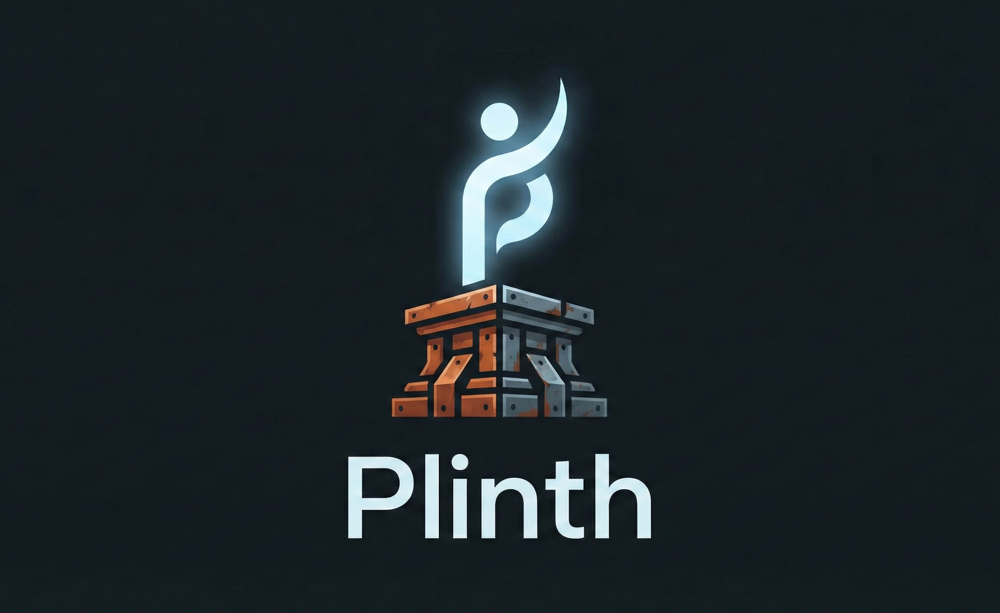

<p align="center">
  
</p>

<p align="center">
  <strong>A full-stack personal website platform built with Leptos 0.8</strong>
</p>

<p align="center">
  <a href="https://codeberg.org/caniko/plinth">Codeberg</a> &middot;
  <a href="https://caniko.codeberg.page/plinth/">Documentation</a>
</p>

---

Plinth is a self-hosted personal website and blog engine written in Rust. It uses [Leptos](https://leptos.dev) for server-side rendering with WASM hydration, [SurrealDB](https://surrealdb.com) as its database, and supports authoring blog posts in both Markdown and [Typst](https://typst.app).

## Features

- **SSR + WASM hydration** — fast initial load with an interactive client
- **SurrealDB** — schema-full graph database with RELATE-based tagging
- **Semantic search** — fastembed vector embeddings with cosine similarity
- **Typst support** — author blog posts in Typst with image management
- **Immich integration** — self-hosted image proxy with aggressive caching
- **NixOS module** — declarative deployment with systemd hardening
- **Plausible analytics** — optional self-hosted Plausible integration
- **OTLP observability** — built-in OpenTelemetry tracing export

## Quick start

```bash
git clone https://codeberg.org/caniko/plinth.git
cd plinth
nix develop
cargo leptos watch
```

Open <http://127.0.0.1:3000> to see your site. Publish a post:

```bash
cargo run --package plinth-cli -- publish my-post.md
```

## Build for production

```bash
nix build .#plinth
```

Output in `result/`:
| Path | Contents |
|------|----------|
| `result/bin/plinth-server` | Server binary (sets `LEPTOS_SITE_ROOT` automatically) |
| `result/site/` | Compiled WASM, JS, CSS, and static assets |
| `result/share/plinth/plinth.toml` | Example configuration |

## Architecture

Four-crate Rust workspace:

| Crate | Role |
|-------|------|
| `plinth-shared` | Domain types shared across all crates |
| `plinth-client` | Leptos frontend compiled to WASM |
| `plinth-server` | Axum HTTP server with Leptos SSR, Kameo actors, SurrealDB |
| `plinth-cli` | CLI for publishing Markdown/Typst articles with embeddings |

## Configuration

Configure via `plinth.toml` and environment variables. See the [configuration docs](https://caniko.codeberg.page/plinth/docs/configuration/plinth-toml/) for all options.

Key environment variables:

| Variable | Default | Purpose |
|----------|---------|---------|
| `SURREALDB_PATH` | `database.db` | DB file path |
| `PLINTH_API_KEY` | `dev_api_key_change_in_production` | Admin API auth |
| `LEPTOS_SITE_ADDR` | `127.0.0.1:3000` | Server bind address |
| `IMMICH_API_URL` | — | Immich server URL for image proxy |
| `PLAUSIBLE_DOMAIN` | — | Site domain for Plausible analytics |
| `PLAUSIBLE_SCRIPT_URL` | — | URL to self-hosted Plausible script |

## Deployment

Plinth includes a NixOS module for declarative deployment:

```nix
{
  services.plinth = {
    enable = true;
    settings.site.name = "My Site";
  };
}
```

See [deployment docs](https://caniko.codeberg.page/plinth/docs/deployment/nixos-module/) for full options including reverse proxy setup.

## CI

Woodpecker CI on Codeberg runs `nix flake check` (build, clippy, fmt, and tests) on every push and pull request.

## License

EUPL-1.2. See [LICENSE](LICENSE) for details.
